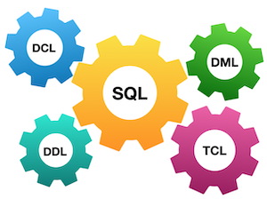
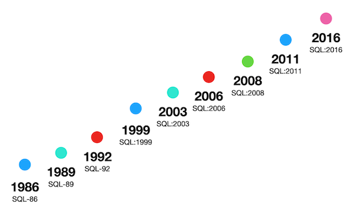
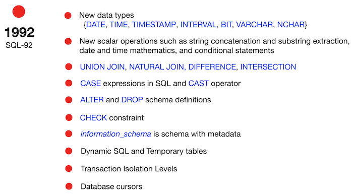
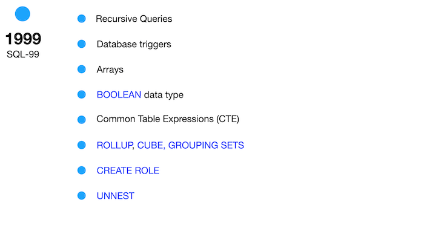
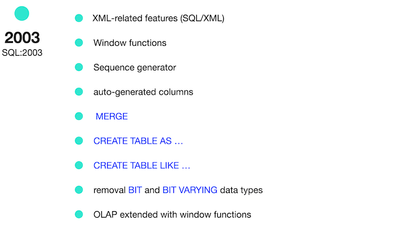
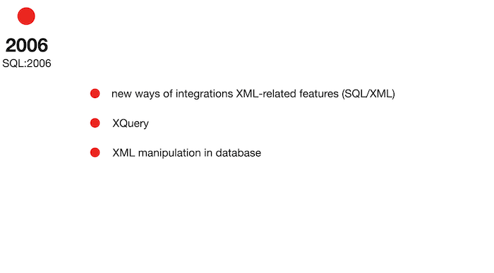
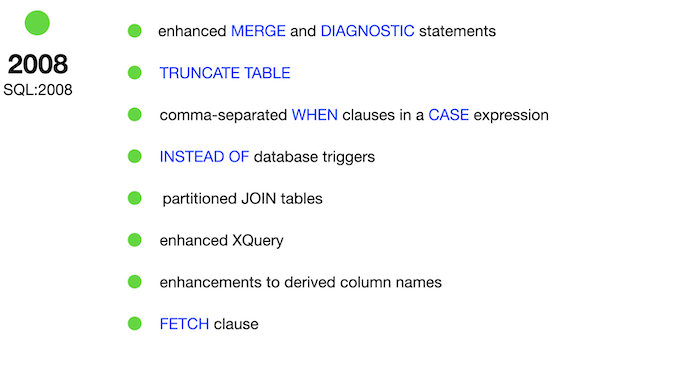
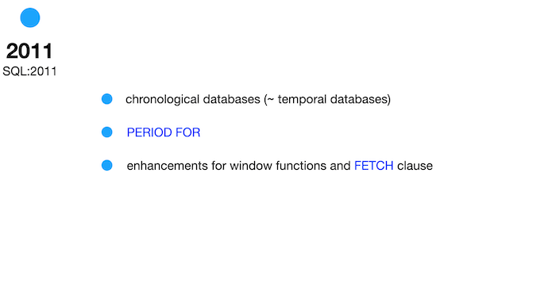

# Day 00 - Piscine SQL

## _Relational Data Model and SQL_

Resume: Today you will see how relational model works and how to get needed data based on basic constructions of  SQL

## Contents

1. [Chapter I](#chapter-i) \
    1.1. [Preamble](#preamble)
2. [Chapter II](#chapter-ii) \
    2.1. [General Rules](#general-rules)
3. [Chapter III](#chapter-iii) \
    3.1. [Rules of the day](#rules-of-the-day)  
4. [Chapter IV](#chapter-iv) \
    4.1. [Exercise 00 - First steps into SQL world](#exercise-00-first-steps-into-sql-world)  
5. [Chapter V](#chapter-v) \
    5.1. [Exercise 01 - First steps into SQL world](#exercise-01-first-steps-into-sql-world)  
6. [Chapter VI](#chapter-vi) \
    6.1. [Exercise 02 - First steps into SQL world](#exercise-02-first-steps-into-sql-world)  
7. [Chapter VII](#chapter-vii) \
    7.1. [Exercise 03 - First steps into SQL world](#exercise-03-first-steps-into-sql-world)  
8. [Chapter VIII](#chapter-viii) \
    8.1. [Exercise 04 - First steps into SQL world](#exercise-04-first-steps-into-sql-world)
9. [Chapter IX](#chapter-ix) \
    9.1. [Exercise 05 - First steps into SQL world](#exercise-05-first-steps-into-sql-world)
10. [Chapter X](#chapter-x) \
    10.1. [Exercise 06 - First steps into SQL world](#exercise-06-first-steps-into-sql-world)
11. [Chapter XI](#chapter-xi) \
    11.1. [Exercise 07 - First steps into SQL world](#exercise-07-first-steps-into-sql-world)
12. [Chapter XII](#chapter-xii) \
    12.1. [Exercise 08 - First steps into SQL world](#exercise-08-first-steps-into-sql-world)
13. [Chapter XIII](#chapter-xiii) \
    13.1. [Exercise 09 - First steps into SQL world](#exercise-09-first-steps-into-sql-world)

## Chapter I
## Preamble

Standards are everywhere, and Relational Databases are under control as well :-). To be honest between us, more restricted SQL standards were at the beginning of 2000 years. Actually when the “Big Data” pattern was born, Relational Databases had their own way to realize this pattern and therefore standards right now are more ... lightweight. 

Please take a look at some SQL standards below and try to think about the future of Relational Databases.

|  |  |
| ------ | ------ |
|  |  |
|  |  |
|  |  |

## Chapter II
## General Rules

- Use this page as the only reference. Do not listen to any rumors and speculations on how to prepare your solution.
- Please make sure you are using the latest version of PostgreSQL.
- That is completely OK if you are using IDE to write a source code (aka SQL script).
- To be assessed your solution must be in your GIT repository.
- Your solutions will be evaluated by your piscine mates.
- You should not leave in your directory any other file than those explicitly specified by the exercise instructions. It is recommended that you modify your `.gitignore` to avoid accidents.
- Do you have a question? Ask your neighbor on the right. Otherwise, try with your neighbor on the left.
- Your reference manual: mates / Internet / Google. 
- Read the examples carefully. They may require things that are not otherwise specified in the subject.
- And may the SQL-Force be with you!
- Absolutely everything can be presented in SQL! Let’s start and have fun!

## Chapter III
## Rules of the day

- Please make sure you have an own database and access for it on your PostgreSQL cluster. 
- Please download a [script](materials/model.sql) with Database Model here and apply the script to your database (you can use command line with psql or just run it through any IDE, for example DataGrip from JetBrains or pgAdmin from PostgreSQL community). 
- All tasks contain a list of Allowed and Denied sections with listed database options, database types, SQL constructions etc. Please have a look at the section before you start.
- Please take a look at the Logical View of our Database Model. 

1. **pizzeria** table (Dictionary Table with available pizzerias)
- field id - primary key
- field name - name of pizzeria
- field rating - average rating of pizzeria (from 0 to 5 points)
2. **person** table (Dictionary Table with persons who loves pizza)
- field id - primary key
- field name - name of person
- field age - age of person
- field gender - gender of person
- field address - address of person
3. **menu** table (Dictionary Table with available menu and price for concrete pizza)
- field id - primary key
- field pizzeria_id - foreign key to pizzeria
- field pizza_name - name of pizza in pizzeria
- field price - price of concrete pizza
4. **person_visits** table (Operational Table with information about visits of pizzeria)
- field id - primary key
- field person_id - foreign key to person
- field pizzeria_id - foreign key to pizzeria
- field visit_date - date (for example 2022-01-01) of person visit 
5. **person_order** table (Operational Table with information about persons orders)
- field id - primary key
- field person_id - foreign key to person
- field menu_id - foreign key to menu
- field order_date - date (for example 2022-01-01) of person order 

Persons' visit and persons' order are different entities and don't contain any correlation between data. For example, a client can be in one restraunt (just looking at menu) and in this time make an order in different one by phone or by mobile application. Or another case,  just be at home and again make a call with order without any visits.

## Chapter IV
## Exercise 00 - First steps into SQL world

| Exercise 00: First steps into SQL world |                                                                                                                          |
|---------------------------------------|--------------------------------------------------------------------------------------------------------------------------|
| Turn-in directory                     | ex00                                                                                                                     |
| Files to turn-in                      | `day00_ex00.sql`                                                                                 |
| **Allowed**                               |                                                                                                                          |
| Language                        | ANSI SQL                                                                                              |

Let’s make our first task. 
Please make a select statement which returns all person's names and person's ages from the city ‘Kazan’.

## Chapter V
## Exercise 01 - First steps into SQL world

| Exercise 01: First steps into SQL world |                                                                                                                          |
|---------------------------------------|--------------------------------------------------------------------------------------------------------------------------|
| Turn-in directory                     | ex01                                                                                                                     |
| Files to turn-in                      | `day00_ex01.sql`                                                                                 |
| **Allowed**                               |                                                                                                                          |
| Language                        | ANSI SQL                                                                                              |

Please make a select statement which returns names , ages for all women from the city ‘Kazan’. Yep, and please sort result by name.

## Chapter VI
## Exercise 02 - First steps into SQL world

| Exercise 02: First steps into SQL world |                                                                                                                          |
|---------------------------------------|--------------------------------------------------------------------------------------------------------------------------|
| Turn-in directory                     | ex02                                                                                                                     |
| Files to turn-in                      | `day00_ex02.sql`                                                                                 |
| **Allowed**                               |                                                                                                                          |
| Language                        | ANSI SQL                                                                                              |

Please make 2 syntax different select statements which return a list of pizzerias (pizzeria name and rating) with rating between 3.5 and 5 points (including limit points) and ordered by pizzeria rating.
- the 1st select statement must contain comparison signs  (<=, >=)
- the 2nd select statement must contain `BETWEEN` keyword

## Chapter VII
## Exercise 03 - First steps into SQL world

| Exercise 03: First steps into SQL world |                                                                                                                          |
|---------------------------------------|--------------------------------------------------------------------------------------------------------------------------|
| Turn-in directory                     | ex03                                                                                                                     |
| Files to turn-in                      | `day00_ex03.sql`                                                                                 |
| **Allowed**                               |                                                                                                                          |
| Language                        | ANSI SQL                                                                                              |

Please make a select statement which returns the person's identifiers (without duplication) which visited pizzerias in a period from 6th of January 2022 to 9th of January 2022 (including all days) or visited pizzeria with identifier 2. Also include ordering clause by person identifier in descending mode.

## Chapter VIII
## Exercise 04 - First steps into SQL world

| Exercise 04: First steps into SQL world |                                                                                                                          |
|---------------------------------------|--------------------------------------------------------------------------------------------------------------------------|
| Turn-in directory                     | ex04                                                                                                                     |
| Files to turn-in                      | `day00_ex04.sql`                                                                                 |
| **Allowed**                               |                                                                                                                          |
| Language                        | ANSI SQL                                                                                              |

Please make a select statement which returns one calculated field with name ‘person_information’ in one string like described in the next sample:

`Anna (age:16,gender:'female',address:'Moscow')`

Finally , please add the ordering clause by calculated column in ascending mode.
Please pay attention to quote symbols in your formula!

## Chapter IX
## Exercise 05 - First steps into SQL world

| Exercise 05: First steps into SQL world |                                                                                                                          |
|---------------------------------------|--------------------------------------------------------------------------------------------------------------------------|
| Turn-in directory                     | ex05                                                                                                                     |
| Files to turn-in                      | `day00_ex05.sql`                                                                                 |
| **Allowed**                               |                                                                                                                          |
| Language                        | ANSI SQL                                                                                              |
| **Denied**                               |                                           
| SQL Syntax Construction                        | `IN`, any types of `JOINs`                                                                                              |

Please make a select statement which returns person's names (based on internal query in `SELECT` clause) which made orders for the menu with identifiers 13 , 14 and 18 and date of orders should equal 7th of January 2022. Please be aware with "Denied Section" before your work.

Please take a look at the pattern of internal query.

    SELECT 
	    (SELECT ... ) AS NAME  -- this is an internal query in a main SELECT clause
    FROM ...
    WHERE ...

## Chapter X
## Exercise 06 - First steps into SQL world

| Exercise 06: First steps into SQL world |                                                                                                                          |
|---------------------------------------|--------------------------------------------------------------------------------------------------------------------------|
| Turn-in directory                     | ex06                                                                                                                     |
| Files to turn-in                      | `day00_ex06.sql`                                                                                 |
| **Allowed**                               |                                                                                                                          |
| Language                        | ANSI SQL                                                                                              |
| **Denied**                               |                                           
| SQL Syntax Construction                        | `IN`, any types of `JOINs`                                                                                              |

Please use SQL construction from Exercise 05 and add a new calculated column (use column's name ‘check_name’) with a check statement (a pseudo code for this check is presented below) in the `SELECT` clause.

    if (person_name == 'Denis') then return true
        else return false

## Chapter XI
## Exercise 07 - First steps into SQL world

| Exercise 07: First steps into SQL world |                                                                                                                          |
|---------------------------------------|--------------------------------------------------------------------------------------------------------------------------|
| Turn-in directory                     | ex07                                                                                                                     |
| Files to turn-in                      | `day00_ex07.sql`                                                                                 |
| **Allowed**                               |                                                                                                                          |
| Language                        | ANSI SQL                                                                                              |

Let’s apply data intervals for the `person` table. 
Please make a SQL statement which returns a person's identifiers, person's names and interval of person’s ages (set a name of a new calculated column as ‘interval_info’) based on pseudo code below. 

    if (age >= 10 and age <= 20) then return 'interval #1'
    else if (age > 20 and age < 24) then return 'interval #2'
    else return 'interval #3'

and yes...please sort a result by ‘interval_info’ column in ascending mode.

## Chapter XII
## Exercise 08 - First steps into SQL world

| Exercise 08: First steps into SQL world |                                                                                                                          |
|---------------------------------------|--------------------------------------------------------------------------------------------------------------------------|
| Turn-in directory                     | ex08                                                                                                                     |
| Files to turn-in                      | `day00_ex08.sql`                                                                                 |
| **Allowed**                               |                                                                                                                          |
| Language                        | ANSI SQL                                                                                              |

Please make a SQL statement which returns all columns from the `person_order` table with rows whose identifier is an even number. The result have to order by returned identifier.

## Chapter XIII
## Exercise 09 - First steps into SQL world

| Exercise 09: First steps into SQL world |                                                                                                                          |
|---------------------------------------|--------------------------------------------------------------------------------------------------------------------------|
| Turn-in directory                     | ex09                                                                                                                     |
| Files to turn-in                      | `day00_ex09.sql`                                                                                 |
| **Allowed**                               |                                                                                                                          |
| Language                        | ANSI SQL                                                                                              |
| **Denied**                               |                                           
| SQL Syntax Construction                        | any types of `JOINs`                                                                                              |

Please make a select statement that returns person names and pizzeria names based on the `person_visit` table with date of visit in a period from 07th of January to 09th of January 2022 (including all days) (based on internal query in `FROM` clause) .

Please take a look at the pattern of the final query.

    SELECT (...) AS person_name ,  -- this is an internal query in a main SELECT clause
            (...) AS pizzeria_name  -- this is an internal query in a main SELECT clause
    FROM (SELECT … FROM person_visits WHERE …) AS pv -- this is an internal query in a main FROM clause
    ORDER BY ...

Please add a ordering clause by person name in ascending mode and by pizzeria name in descending mode

