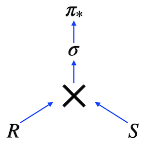

# Day 02 - Piscine SQL

## _Deep diving into JOINs in SQL_

Resume: Today you will see how to get needed data based on different structures JOINs

## Contents

1. [Chapter I](#chapter-i) \
    1.1. [Preamble](#preamble)
2. [Chapter II](#chapter-ii) \
    2.1. [General Rules](#general-rules)
3. [Chapter III](#chapter-iii) \
    3.1. [Rules of the day](#rules-of-the-day)  
4. [Chapter IV](#chapter-iv) \
    4.1. [Exercise 00 - Move to the LEFT, move to the RIGHT](#exercise-00-move-to-the-left-move-to-the-right)  
5. [Chapter V](#chapter-v) \
    5.1. [Exercise 01 - Find data gaps](#exercise-01-find-data-gaps)  
6. [Chapter VI](#chapter-vi) \
    6.1. [Exercise 02 - FULL means ‘completely filled’](#exercise-02-full-means-completely-filled)  
7. [Chapter VII](#chapter-vii) \
    7.1. [Exercise 03 - Reformat to CTE](#exercise-03-reformat-to-cte)  
8. [Chapter VIII](#chapter-viii) \
    8.1. [Exercise 04 - Find a favorite pizzas](#exercise-04-find-a-favorite-pizzas)
9. [Chapter IX](#chapter-ix) \
    9.1. [Exercise 05 - Investigate Person Data](#exercise-05-investigate-person-data)
10. [Chapter X](#chapter-x) \
    10.1. [Exercise 06 - Favorite pizzas for Denis and Anna](#exercise-06-favorite-pizzas-for-denis-and-anna)
11. [Chapter XI](#chapter-xi) \
    11.1. [Exercise 07 - Cheapest pizzeria for Dmitriy](#exercise-07-cheapest-pizzeria-for-dmitriy)
12. [Chapter XII](#chapter-xii) \
    12.1. [Exercise 08 - Continuing to research data](#exercise-08-continuing-to-research-data)
13. [Chapter XIII](#chapter-xiii) \
    13.1. [Exercise 09 - Who loves cheese and pepperoni?](#exercise-09-who-loves-cheese-and-pepperoni)
14. [Chapter XIV](#chapter-xiv) \
    14.1. [Exercise 10 - Find persons from one city](#exercise-10-find-persons-from-one-city)

## Chapter I
## Preamble

In the picture, you can see a Relational Expression in Tree View. This expression corresponds the next SQL query 

    SELECT *
        FROM R CROSS JOIN S
    WHERE clause

So, in other words we can describe any SQL in mathematical terms of Relational Algebra.

The main question (which I hear from my students) is why do we need to learn Relational Algebra in a course, if we can write a SQL in a first attempt? My answer is yes and no in one time. “Yes” means you can write a SQL from the first attempt, that’s right , “No” means you have to know the main aspects of Relational Algebra, because this knowledge is in use for optimization plans and for semantic queries. 
Which type of joins are existing in Relational Algebra?
Actually, “Cross Join” is a primitive operator and it is an anchestor for other types of joins.
- Natural Join
- Theta Join
- Semi Join
- Anti Join
- Left / Right / Full Joins 

But what does a join operation between 2 tables mean? Let me present a part of pseudo code, how join operation works without indexing. 

    FOR r in R LOOP
        FOR s in S LOOP
        if r.id = s.r_id then add(r,s)
        …
        END;
    END;

It’s just a set of loops ... Not magic at all

## Chapter II
## General Rules

- Use this page as the only reference. Do not listen to any rumors and speculations on how to prepare your solution.
- Please make sure you are using the latest version of PostgreSQL.
- That is completely OK if you are using IDE to write a source code (aka SQL script).
- To be assessed your solution must be in your GIT repository.
- Your solutions will be evaluated by your piscine mates.
- You should not leave in your directory any other file than those explicitly specified by the exercise instructions. It is recommended that you modify your `.gitignore` to avoid accidents.
- Do you have a question? Ask your neighbor on the right. Otherwise, try with your neighbor on the left.
- Your reference manual: mates / Internet / Google. 
- Read the examples carefully. They may require things that are not otherwise specified in the subject.
- And may the SQL-Force be with you!
- Absolutely everything can be presented in SQL! Let’s start and have fun!

## Chapter III
## Rules of the day

- Please make sure you have an own database and access for it on your PostgreSQL cluster. 
- Please download a [script](materials/model.sql) with Database Model here and apply the script to your database (you can use command line with psql or just run it through any IDE, for example DataGrip from JetBrains or pgAdmin from PostgreSQL community). 
- All tasks contain a list of Allowed and Denied sections with listed database options, database types, SQL constructions etc. Please have a look at the section before you start.
- Please take a look at the Logical View of our Database Model. 

1. **pizzeria** table (Dictionary Table with available pizzerias)
- field id - primary key
- field name - name of pizzeria
- field rating - average rating of pizzeria (from 0 to 5 points)
2. **person** table (Dictionary Table with persons who loves pizza)
- field id - primary key
- field name - name of person
- field age - age of person
- field gender - gender of person
- field address - address of person
3. **menu** table (Dictionary Table with available menu and price for concrete pizza)
- field id - primary key
- field pizzeria_id - foreign key to pizzeria
- field pizza_name - name of pizza in pizzeria
- field price - price of concrete pizza
4. **person_visits** table (Operational Table with information about visits of pizzeria)
- field id - primary key
- field person_id - foreign key to person
- field pizzeria_id - foreign key to pizzeria
- field visit_date - date (for example 2022-01-01) of person visit 
5. **person_order** table (Operational Table with information about persons orders)
- field id - primary key
- field person_id - foreign key to person
- field menu_id - foreign key to menu
- field order_date - date (for example 2022-01-01) of person order 

Persons' visit and persons' order are different entities and don't contain any correlation between data. For example, a client can be in one restraunt (just looking at menu) and in this time make an order in different one by phone or by mobile application. Or another case,  just be at home and again make a call with order without any visits.

## Chapter IV
## Exercise 00 - Move to the LEFT, move to the RIGHT

| Exercise 00: Move to the LEFT, move to the RIGHT |                                                                                                                          |
|---------------------------------------|--------------------------------------------------------------------------------------------------------------------------|
| Turn-in directory                     | ex00                                                                                                                     |
| Files to turn-in                      | `day02_ex00.sql`                                                                                 |
| **Allowed**                               |                                                                                                                          |
| Language                        | ANSI SQL                                                                                              |
| **Denied**                               |                                                                                                                          |
| SQL Syntax Construction                        | `NOT IN`, `IN`, `NOT EXISTS`, `EXISTS`, `UNION`, `EXCEPT`, `INTERSECT`                                                                                              |

Please write a SQL statement which returns a list of pizzerias names with corresponding rating value which have not been visited by persons. 

## Chapter V
## Exercise 01 - Find data gaps

| Exercise 01: Find data gaps|                                                                                                                          |
|---------------------------------------|--------------------------------------------------------------------------------------------------------------------------|
| Turn-in directory                     | ex01                                                                                                                     |
| Files to turn-in                      | `day02_ex01.sql`                                                                                 |
| **Allowed**                               |                                                                                                                          |
| Language                        | ANSI SQL                                                                                              |
| SQL Syntax Construction                        | `generate_series(...)`                                                                                              |
| **Denied**                               |                                                                                                                          |
| SQL Syntax Construction                        | `NOT IN`, `IN`, `NOT EXISTS`, `EXISTS`, `UNION`, `EXCEPT`, `INTERSECT`                                                                                              |

Please write a SQL statement which returns the missing days from 1st to 10th of January 2022 (including all days) for visits  of persons with identifiers 1 or 2. Please order by visiting days in ascending mode. The sample of data with column name is presented below.

| missing_date |
| ------ |
| 2022-01-03 |
| 2022-01-04 |
| 2022-01-05 |
| ... |

## Chapter VI
## Exercise 02 - FULL means ‘completely filled’

| Exercise 02: FULL means ‘completely filled’|                                                                                                                          |
|---------------------------------------|--------------------------------------------------------------------------------------------------------------------------|
| Turn-in directory                     | ex02                                                                                                                     |
| Files to turn-in                      | `day02_ex02.sql`                                                                                 |
| **Allowed**                               |                                                                                                                          |
| Language                        | ANSI SQL                                                                                              |
| **Denied**                               |                                                                                                                          |
| SQL Syntax Construction                        | `NOT IN`, `IN`, `NOT EXISTS`, `EXISTS`, `UNION`, `EXCEPT`, `INTERSECT`                                                                                              |

Please write a SQL statement that returns a whole list of person names visited (or not visited) pizzerias during the period from 1st to 3rd of January 2022 from one side and the whole list of pizzeria names which have been visited (or not visited) from the other side. The data sample with needed column names is presented below. Please pay attention to the substitution value ‘-’ for `NULL` values in `person_name` and `pizzeria_name` columns. Please also add ordering for all 3 columns.

| person_name | visit_date | pizzeria_name |
| ------ | ------ | ------ |
| - | null | DinoPizza |
| - | null | DoDo Pizza |
| Andrey | 2022-01-01 | Dominos |
| Andrey | 2022-01-02 | Pizza Hut |
| Anna | 2022-01-01 | Pizza Hut |
| Denis | null | - |
| Dmitriy | null | - |
| ... | ... | ... |

## Chapter VII
## Exercise 03 - Reformat to CTE

| Exercise 03: Reformat to CTE |                                                                                                                          |
|---------------------------------------|--------------------------------------------------------------------------------------------------------------------------|
| Turn-in directory                     | ex03                                                                                                                     |
| Files to turn-in                      | `day02_ex03.sql`                                                                                 |
| **Allowed**                               |                                                                                                                          |
| Language                        | ANSI SQL                                                                                              |
| SQL Syntax Construction                        | `generate_series(...)`                                                                                              |
| **Denied**                               |                                                                                                                          |
| SQL Syntax Construction                        | `NOT IN`, `IN`, `NOT EXISTS`, `EXISTS`, `UNION`, `EXCEPT`, `INTERSECT`                                                                                              |

Let’s return back to Exercise #01, please rewrite your SQL by using the CTE (Common Table Expression) pattern. Please move into the CTE part of your "day generator". The result should be similar like in Exercise #01

| missing_date | 
| ------ | 
| 2022-01-03 | 
| 2022-01-04 | 
| 2022-01-05 | 
| ... |

## Chapter VIII
## Exercise 04 - Find a favorite pizzas

| Exercise 04: Find a favorite pizzas |                                                                                                                          |
|---------------------------------------|--------------------------------------------------------------------------------------------------------------------------|
| Turn-in directory                     | ex04                                                                                                                     |
| Files to turn-in                      | `day02_ex04.sql`                                                                                 |
| **Allowed**                               |                                                                                                                          |
| Language                        | ANSI SQL                                                                                              |

Find full information about all possible pizzeria names and prices to get mushroom or pepperoni pizzas. Please sort the result by pizza name and pizzeria name then. The result of sample data is below (please use the same column names in your SQL statement).

| pizza_name | pizzeria_name | price |
| ------ | ------ | ------ |
| mushroom pizza | Dominos | 1100 |
| mushroom pizza | Papa Johns | 950 |
| pepperoni pizza | Best Pizza | 800 |
| ... | ... | ... |

## Chapter IX
## Exercise 05 - Investigate Person Data

| Exercise 05: Investigate Person Data |                                                                                                                          |
|---------------------------------------|--------------------------------------------------------------------------------------------------------------------------|
| Turn-in directory                     | ex05                                                                                                                     |
| Files to turn-in                      | `day02_ex05.sql`                                                                                 |
| **Allowed**                               |                                                                                                                          |
| Language                        | ANSI SQL                                                                                              |

Find names of all female persons older than 25 and order the result by name. The sample of output is presented below.

| name | 
| ------ | 
| Elvira | 
| ... |

## Chapter X
## Exercise 06 - Favorite pizzas for Denis and Anna

| Exercise 06: Favorite pizzas for Denis and Anna |                                                                                                                          |
|---------------------------------------|--------------------------------------------------------------------------------------------------------------------------|
| Turn-in directory                     | ex06                                                                                                                     |
| Files to turn-in                      | `day02_ex06.sql`                                                                                 |
| **Allowed**                               |                                                                                                                          |
| Language                        | ANSI SQL                                                                                              |

Please find all pizza names (and corresponding pizzeria names using `menu` table) that Denis or Anna ordered. Sort a result by both columns. The sample of output is presented below.

| pizza_name | pizzeria_name |
| ------ | ------ |
| cheese pizza | Best Pizza |
| cheese pizza | Pizza Hut |
| ... | ... |

## Chapter XI
## Exercise 07 - Cheapest pizzeria for Dmitriy

| Exercise 07: Cheapest pizzeria for Dmitriy |                                                                                                                          |
|---------------------------------------|--------------------------------------------------------------------------------------------------------------------------|
| Turn-in directory                     | ex07                                                                                                                     |
| Files to turn-in                      | `day02_ex07.sql`                                                                                 |
| **Allowed**                               |                                                                                                                          |
| Language                        | ANSI SQL                                                                                              |

Please find the name of pizzeria Dmitriy visited on January 8, 2022 and could eat pizza for less than 800 rubles.

## Chapter XII
## Exercise 08 - Continuing to research data

| Exercise 08: Continuing to research data |                                                                                                                          |
|---------------------------------------|--------------------------------------------------------------------------------------------------------------------------|
| Turn-in directory                     | ex08                                                                                                                     |
| Files to turn-in                      | `day02_ex08.sql`                                                                                 |
| **Allowed**                               |                                                                                                                          |
| Language                        | ANSI SQL                                                                                              |           

Please find the names of all males from Moscow or Samara cities who orders either pepperoni or mushroom pizzas (or both) . Please order the result by person name in descending mode. The sample of output is presented below.

| name | 
| ------ | 
| Dmitriy | 
| ... |

## Chapter XIII
## Exercise 09 - Who loves cheese and pepperoni?

| Exercise 09: Who loves cheese and pepperoni? |                                                                                                                          |
|---------------------------------------|--------------------------------------------------------------------------------------------------------------------------|
| Turn-in directory                     | ex09                                                                                                                     |
| Files to turn-in                      | `day02_ex09.sql`                                                                                 |
| **Allowed**                               |                                                                                                                          |
| Language                        | ANSI SQL                                                                                              |

Please find the names of all females who ordered both pepperoni and cheese pizzas (at any time and in any pizzerias). Make sure that the result is ordered by person name. The sample of data is presented below.

| name | 
| ------ | 
| Anna | 
| ... |

## Chapter XIV
## Exercise 10 - Find persons from one city

| Exercise 10: Find persons from one city |                                                                                                                          |
|---------------------------------------|--------------------------------------------------------------------------------------------------------------------------|
| Turn-in directory                     | ex10                                                                                                                     |
| Files to turn-in                      | `day02_ex10.sql`                                                                                 |
| **Allowed**                               |                                                                                                                          |
| Language                        | ANSI SQL                                                                                              |

Please find the names of persons who live on the same address. Make sure that the result is ordered by 1st person, 2nd person's name and common address. The  data sample is presented below. Please make sure your column names are corresponding column names below.

| person_name1 | person_name2 | common_address | 
| ------ | ------ | ------ |
| Andrey | Anna | Moscow |
| Denis | Kate | Kazan |
| Elvira | Denis | Kazan |
| ... | ... | ... |

