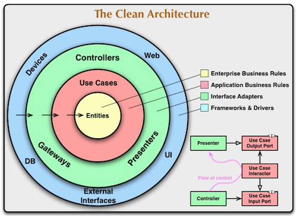
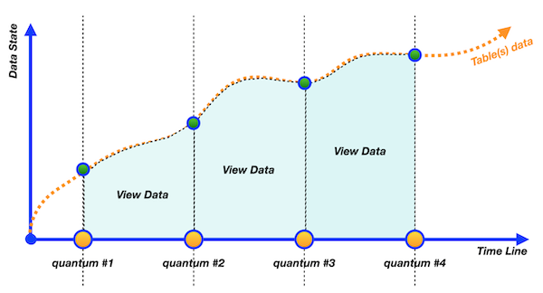
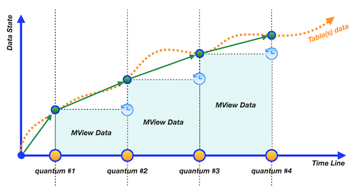
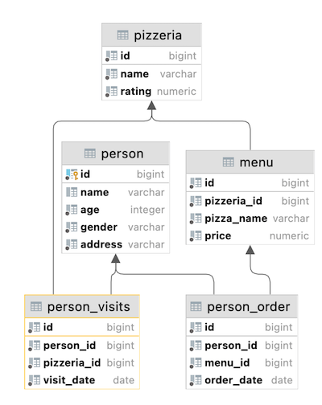

# Day 04 - Piscine SQL

## _Snapshots, virtual tables… What is going on?_

Resume: Today you will see how to use a virtual view and physical snapshot of data

## Contents

1. [Chapter I](#chapter-i) \
    1.1. [Preamble](#preamble)
2. [Chapter II](#chapter-ii) \
    2.1. [General Rules](#general-rules)
3. [Chapter III](#chapter-iii) \
    3.1. [Rules of the day](#rules-of-the-day)  
4. [Chapter IV](#chapter-iv) \
    4.1. [Exercise 00 - Let’s create separated views for persons](#exercise-00-lets-create-separated-views-for-persons)  
5. [Chapter V](#chapter-v) \
    5.1. [Exercise 01 - From parts to common view](#exercise-01-from-parts-to-common-view)  
6. [Chapter VI](#chapter-vi) \
    6.1. [Exercise 02 - “Store” generated dates in one place](#exercise-02-store-generated-dates-in-one-place)  
7. [Chapter VII](#chapter-vii) \
    7.1. [Exercise 03 - Find missing visit days with Database View](#exercise-03-find-missing-visit-days-with-database-view)  
8. [Chapter VIII](#chapter-viii) \
    8.1. [Exercise 04 - Let’s find something from Set Theory](#exercise-04-lets-find-something-from-set-theory)
9. [Chapter IX](#chapter-ix) \
    9.1. [Exercise 05 - Let’s calculate a discount price for each person](#exercise-05-lets-calculate-a-discount-price-for-each-person)
10. [Chapter X](#chapter-x) \
    10.1. [Exercise 06 - Materialization from virtualization](#exercise-06-materialization-from-virtualization)
11. [Chapter XI](#chapter-xi) \
    11.1. [Exercise 07 - Refresh our state](#exercise-07-refresh-our-state)
12. [Chapter XII](#chapter-xii) \
    12.1. [Exercise 08 - Just clear our database](#exercise-08-just-clear-our-database)

## Chapter I
## Preamble

Why do we need virtual tables and materialized views in databases? Databases are just tables, aren't they? 
No, actually not. Databases are similar for object-oriented language. Just recall, you have a lot of abstraction in Java (I mean Java Interfaces). We need abstraction to achieve “Clean Architecture” and change objects with minimal effect on dependencies (sometimes it’s working :-). 

Moreover, there is a specific architectures’ pattern in the Relational Database with the name ANSI/SPARK.
This pattern splits objects on three levels: 
- external level
- conceptual level
- internal level

Therefore we can say that Virtual Tables and Materialized Views are physical interfaces between tables with data and user / application.
So, what is the difference then between 2 objects? The main difference is in the “freshness of data”. Below , you can see behaviors of these objects in graphical representation.

|  |  |
| ------ | ------ |
| View is a continuous object with the same data like in the underlying table(s), that are used to create this view. Other words, if we select data from view, view reroutes our query to underlying objects and then returns results for us. |  |
|  | Materialized View is a discrete object. Other words, we need to wait when the Materialized View will be refreshed based on an “event trigger” (for example, time schedule). This object always is behind actual data in underlying tables. |

Also, there are “a few” additional differences between View and Materialized View.
- Virtual Table can work with `INSERT/UPDATE/DELETE` traffic but with some restrictions. 
- Virtual Tables can have “Instead Of” Triggers to make a better control of incoming `INSERT/UPDATE/DELETE` traffic.
- Materialized View is ReadOnly object for `INSERT/UPDATE/DELETE` traffic
- Materialized Views can have user defined indexes on columns to speed up queries

## Chapter II
## General Rules

- Use this page as the only reference. Do not listen to any rumors and speculations on how to prepare your solution.
- Please make sure you are using the latest version of PostgreSQL.
- That is completely OK if you are using IDE to write a source code (aka SQL script).
- To be assessed your solution must be in your GIT repository.
- Your solutions will be evaluated by your piscine mates.
- You should not leave in your directory any other file than those explicitly specified by the exercise instructions. It is recommended that you modify your `.gitignore` to avoid accidents.
- Do you have a question? Ask your neighbor on the right. Otherwise, try with your neighbor on the left.
- Your reference manual: mates / Internet / Google. 
- Read the examples carefully. They may require things that are not otherwise specified in the subject.
- And may the SQL-Force be with you!
- Absolutely everything can be presented in SQL! Let’s start and have fun!

## Chapter III
## Rules of the day

- Please make sure you have an own database and access for it on your PostgreSQL cluster. 
- Please download a [script](materials/model.sql) with Database Model here and apply the script to your database (you can use command line with psql or just run it through any IDE, for example DataGrip from JetBrains or pgAdmin from PostgreSQL community). **Our knowledge way is incremental and linear therefore please be aware all changes that you made in Day03 during exercises 07-13 should be on place (its similar like in real world , when we applied a release and need to be consistency with data for new changes).**
- All tasks contain a list of Allowed and Denied sections with listed database options, database types, SQL constructions etc. Please have a look at the section before you start.
- Please take a look at the Logical View of our Database Model. 

1. **pizzeria** table (Dictionary Table with available pizzerias)
- field id - primary key
- field name - name of pizzeria
- field rating - average rating of pizzeria (from 0 to 5 points)
2. **person** table (Dictionary Table with persons who loves pizza)
- field id - primary key
- field name - name of person
- field age - age of person
- field gender - gender of person
- field address - address of person
3. **menu** table (Dictionary Table with available menu and price for concrete pizza)
- field id - primary key
- field pizzeria_id - foreign key to pizzeria
- field pizza_name - name of pizza in pizzeria
- field price - price of concrete pizza
4. **person_visits** table (Operational Table with information about visits of pizzeria)
- field id - primary key
- field person_id - foreign key to person
- field pizzeria_id - foreign key to pizzeria
- field visit_date - date (for example 2022-01-01) of person visit 
5. **person_order** table (Operational Table with information about persons orders)
- field id - primary key
- field person_id - foreign key to person
- field menu_id - foreign key to menu
- field order_date - date (for example 2022-01-01) of person order 

Persons' visit and persons' order are different entities and don't contain any correlation between data. For example, a client can be in one restraunt (just looking at menu) and in this time make an order in different one by phone or by mobile application. Or another case,  just be at home and again make a call with order without any visits.

## Chapter IV
## Exercise 00 - Let’s create separated views for persons

| Exercise 00: Let’s create separated views for persons |                                                                                                                          |
|---------------------------------------|--------------------------------------------------------------------------------------------------------------------------|
| Turn-in directory                     | ex00                                                                                                                     |
| Files to turn-in                      | `day04_ex00.sql`                                                                                 |
| **Allowed**                               |                                                                                                                          |
| Language                        | ANSI SQL                                                                                              |

Please create 2 Database Views (with similar attributes like the original table) based on simple filtering of gender of persons. Set the corresponding names for the database views: `v_persons_female` and `v_persons_male`.

## Chapter V
## Exercise 01 - From parts to common view

| Exercise 01: From parts to common view|                                                                                                                          |
|---------------------------------------|--------------------------------------------------------------------------------------------------------------------------|
| Turn-in directory                     | ex01                                                                                                                     |
| Files to turn-in                      | `day04_ex01.sql`                                                                                 |
| **Allowed**                               |                                                                                                                          |
| Language                        | ANSI SQL                                                                                              |

Please use 2 Database Views from Exercise #00 and write SQL to get female and male person names in one list. Please set the order by person name. The sample of data is presented below.

| name |
| ------ |
| Andrey |
| Anna |
| ... |

## Chapter VI
## Exercise 02 - “Store” generated dates in one place

| Exercise 02: “Store” generated dates in one place|                                                                                                                          |
|---------------------------------------|--------------------------------------------------------------------------------------------------------------------------|
| Turn-in directory                     | ex02                                                                                                                     |
| Files to turn-in                      | `day04_ex02.sql`                                                                                 |
| **Allowed**                               |                                                                                                                          |
| Language                        | ANSI SQL                                                                                              |
| SQL Syntax Construction                        | `generate_series(...)`                                                                                              |

Please create a Database View (with name `v_generated_dates`) which should be “store” generated dates from 1st to 31th of January 2022 in DATE type. Don’t forget about order for the generated_date column.  

| generated_date |
| ------ |
| 2022-01-01 |
| 2022-01-02 |
| ... |

## Chapter VII
## Exercise 03 - Find missing visit days with Database View

| Exercise 03: Find missing visit days with Database View |                                                                                                                          |
|---------------------------------------|--------------------------------------------------------------------------------------------------------------------------|
| Turn-in directory                     | ex03                                                                                                                     |
| Files to turn-in                      | `day04_ex03.sql`                                                                                 |
| **Allowed**                               |                                                                                                                          |
| Language                        | ANSI SQL                                                                                              |

Please write a SQL statement which returns missing days for persons’ visits in January of 2022. Use `v_generated_dates` view for that task and sort the result by missing_date column. The sample of data is presented below.

| missing_date |
| ------ |
| 2022-01-11 |
| 2022-01-12 |
| ... |

## Chapter VIII
## Exercise 04 - Let’s find something from Set Theory

| Exercise 04: Let’s find something from Set Theory |                                                                                                                          |
|---------------------------------------|--------------------------------------------------------------------------------------------------------------------------|
| Turn-in directory                     | ex04                                                                                                                     |
| Files to turn-in                      | `day04_ex04.sql`                                                                                 |
| **Allowed**                               |                                                                                                                          |
| Language                        | ANSI SQL                                                                                              |

Please write a SQL statement which satisfies a formula `(R - S)∪(S - R)` .
Where R is the `person_visits` table with filter by 2nd of January 2022, S is also `person_visits` table but with a different filter by 6th of January 2022. Please make your calculations with sets under the `person_id` column and this column will be alone in a result. The result please sort by `person_id` column and your final SQL please present in `v_symmetric_union` (*) database view.

(*) to be honest, the definition “symmetric union” doesn’t exist in Set Theory. This is the author's interpretation, the main idea is based on the existing rule of symmetric difference. 

## Chapter IX
## Exercise 05 - Let’s calculate a discount price for each person

| Exercise 05: Let’s calculate a discount price for each person |                                                                                                                          |
|---------------------------------------|--------------------------------------------------------------------------------------------------------------------------|
| Turn-in directory                     | ex05                                                                                                                     |
| Files to turn-in                      | `day04_ex05.sql`                                                                                 |
| **Allowed**                               |                                                                                                                          |
| Language                        | ANSI SQL                                                                                              |

Please create a Database View `v_price_with_discount` that returns a person's orders with person names, pizza names, real price and calculated column `discount_price` (with applied 10% discount and satisfies formula `price - price*0.1`). The result please sort by person name and pizza name and make a round for `discount_price` column to integer type. Please take a look at a sample result below.

| name |  pizza_name | price | discount_price |
| ------ | ------ | ------ | ------ | 
| Andrey | cheese pizza | 800 | 720 | 
| Andrey | mushroom pizza | 1100 | 990 |
| ... | ... | ... | ... |

## Chapter X
## Exercise 06 - Materialization from virtualization

| Exercise 06: Materialization from virtualization |                                                                                                                          |
|---------------------------------------|--------------------------------------------------------------------------------------------------------------------------|
| Turn-in directory                     | ex06                                                                                                                     |
| Files to turn-in                      | `day04_ex06.sql`                                                                                 |
| **Allowed**                               |                                                                                                                          |
| Language                        | ANSI SQL                                                                                              |

Please create a Materialized View `mv_dmitriy_visits_and_eats` (with data included) based on SQL statement that finds the name of pizzeria Dmitriy visited on January 8, 2022 and could eat pizzas for less than 800 rubles (this SQL you can find out at Day #02 Exercise #07). 

To check yourself you can write SQL to Materialized View `mv_dmitriy_visits_and_eats` and compare results with your previous query.

## Chapter XI
## Exercise 07 - Refresh our state

| Exercise 07: Refresh our state|                                                                                                                          |
|---------------------------------------|--------------------------------------------------------------------------------------------------------------------------|
| Turn-in directory                     | ex07                                                                                                                     |
| Files to turn-in                      | `day04_ex07.sql`                                                                                 |
| **Allowed**                               |                                                                                                                          |
| Language                        | ANSI SQL                                                                                              |
| **Denied**                               |                                                                                                                          |
| SQL Syntax Pattern                        | Don’t use direct numbers for identifiers of Primary Key, person and pizzeria                                                                                               |

Let's refresh data in our Materialized View `mv_dmitriy_visits_and_eats` from exercise #06. Before this action, please generate one more Dmitriy visit that satisfies the SQL clause of Materialized View except pizzeria that we can see in a result from exercise #06.
After adding a new visit please refresh a state of data for `mv_dmitriy_visits_and_eats`.

## Chapter XII
## Exercise 08 - Just clear our database

| Exercise 08: Just clear our database |                                                                                                                          |
|---------------------------------------|--------------------------------------------------------------------------------------------------------------------------|
| Turn-in directory                     | ex08                                                                                                                     |
| Files to turn-in                      | `day04_ex08.sql`                                                                                 |
| **Allowed**                               |                                                                                                                          |
| Language                        | ANSI SQL                                                                                              |           

After all our exercises were born a few Virtual Tables and one Materialized View. Let’s drop them!

