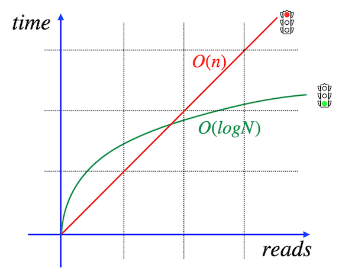
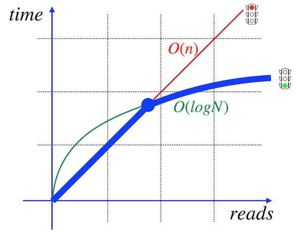

# Day 05 - Piscine SQL

## _I improved my SQL Query! Please, provide proof!_

Resume: Today you will see how and when to create database indexes

## Contents

1. [Chapter I](#chapter-i) \
    1.1. [Preamble](#preamble)
2. [Chapter II](#chapter-ii) \
    2.1. [General Rules](#general-rules)
3. [Chapter III](#chapter-iii) \
    3.1. [Rules of the day](#rules-of-the-day)  
4. [Chapter IV](#chapter-iv) \
    4.1. [Exercise 00 - Let’s create indexes for every foreign key](#exercise-00-lets-create-indexes-for-every-foreign-key)  
5. [Chapter V](#chapter-v) \
    5.1. [Exercise 01 - How to see that index works?](#exercise-01-how-to-see-that-index-works)  
6. [Chapter VI](#chapter-vi) \
    6.1. [Exercise 02 - Formula is in the index. Is it Ok?](#exercise-02-formula-is-in-the-index-is-it-ok)  
7. [Chapter VII](#chapter-vii) \
    7.1. [Exercise 03 - Multicolumn index for our goals](#exercise-03-multicolumn-index-for-our-goals)  
8. [Chapter VIII](#chapter-viii) \
    8.1. [Exercise 04 - Uniqueness for data](#exercise-04-uniqueness-for-data)
9. [Chapter IX](#chapter-ix) \
    9.1. [Exercise 05 - Partial uniqueness for data](#exercise-05-partial-uniqueness-for-data)
10. [Chapter X](#chapter-x) \
    10.1. [Exercise 06 - Let’s make performance improvement](#exercise-06-lets-make-performance-improvement)

## Chapter I
## Preamble

How does indexing make us faster? Why does the same SQL query with and without index have differences in TPS (Transaction Per Second? Actually, from “user-point-of-view”, index is just a “black box” with magic inside. From “mathematical-point-of-view”, index is just an organized structure and no magic actually. 

Let me explain the reason why the index exists but is not used. 

|  |  |
| ------ | ------ |
| Please take a look at the picture, the red line means linear time to find data based on a query. Other words, if you need to find something then you have to see in each block , page , tuple and create a list of your searching rows. (this term has a name “sequential scanning”). Actually, if you created a BTree index, then you got an improvement for speed. So, the green line corresponds to logarithmic searching time. Let’s imagine,  if you have 1000000 rows, and to make a search for 1 row , you need, saying ... 1 second then in total you need 1000000 seconds, but with index you need ln(1000000) ~ 14 seconds |  |
|  | But why… index is not working? There are different reasons to be honest, but the main one is based on the total number of rows of the indexed table. Please take a look at a picture, I drawed a bold blue line and this is a path for searching algorithms. As you can see, linear time at the beginning is most appropriate for algorithms instead of using logarithmic search. How does one detect this intersection point? Basically I can recommend experiments, benchmarks and … your intuition. No formulas at all. Therefore sometimes, if you want to compare  results of your searching, you need to disable sequential scanning explicitly. For example, there is a special command  set enable_seqscan =off in PostgreSQL |

## Chapter II
## General Rules

- Use this page as the only reference. Do not listen to any rumors and speculations on how to prepare your solution.
- Please make sure you are using the latest version of PostgreSQL.
- That is completely OK if you are using IDE to write a source code (aka SQL script).
- To be assessed your solution must be in your GIT repository.
- Your solutions will be evaluated by your piscine mates.
- You should not leave in your directory any other file than those explicitly specified by the exercise instructions. It is recommended that you modify your `.gitignore` to avoid accidents.
- Do you have a question? Ask your neighbor on the right. Otherwise, try with your neighbor on the left.
- Your reference manual: mates / Internet / Google. 
- Read the examples carefully. They may require things that are not otherwise specified in the subject.
- And may the SQL-Force be with you!
- Absolutely everything can be presented in SQL! Let’s start and have fun!

## Chapter III
## Rules of the day

- Please make sure you have an own database and access for it on your PostgreSQL cluster. 
- Please download a [script](materials/model.sql) with Database Model here and apply the script to your database (you can use command line with psql or just run it through any IDE, for example DataGrip from JetBrains or pgAdmin from PostgreSQL community). **Our knowledge way is incremental and linear therefore please be aware all changes that you made in Day03 during exercises 07-13 should be on place (its similar like in real world , when we applied a release and need to be consistency with data for new changes).**
- All tasks contain a list of Allowed and Denied sections with listed database options, database types, SQL constructions etc. Please have a look at the section before you start.
- Please take a look at the Logical View of our Database Model. 

1. **pizzeria** table (Dictionary Table with available pizzerias)
- field id - primary key
- field name - name of pizzeria
- field rating - average rating of pizzeria (from 0 to 5 points)
2. **person** table (Dictionary Table with persons who loves pizza)
- field id - primary key
- field name - name of person
- field age - age of person
- field gender - gender of person
- field address - address of person
3. **menu** table (Dictionary Table with available menu and price for concrete pizza)
- field id - primary key
- field pizzeria_id - foreign key to pizzeria
- field pizza_name - name of pizza in pizzeria
- field price - price of concrete pizza
4. **person_visits** table (Operational Table with information about visits of pizzeria)
- field id - primary key
- field person_id - foreign key to person
- field pizzeria_id - foreign key to pizzeria
- field visit_date - date (for example 2022-01-01) of person visit 
5. **person_order** table (Operational Table with information about persons orders)
- field id - primary key
- field person_id - foreign key to person
- field menu_id - foreign key to menu
- field order_date - date (for example 2022-01-01) of person order 

Persons' visit and persons' order are different entities and don't contain any correlation between data. For example, a client can be in one restraunt (just looking at menu) and in this time make an order in different one by phone or by mobile application. Or another case,  just be at home and again make a call with order without any visits.

## Chapter IV
## Exercise 00 - Let’s create indexes for every foreign key

| Exercise 00: Let’s create indexes for every foreign key |                                                                                                                          |
|---------------------------------------|--------------------------------------------------------------------------------------------------------------------------|
| Turn-in directory                     | ex00                                                                                                                     |
| Files to turn-in                      | `day05_ex00.sql`                                                                                 |
| **Allowed**                               |                                                                                                                          |
| Language                        | ANSI SQL                                                                                              |

Please create a simple BTree index for every foreign key in our database. The name pattern should satisfy the next rule “idx_{table_name}_{column_name}”. For example, the name BTree index for the pizzeria_id column in the `menu` table is `idx_menu_pizzeria_id`.

## Chapter V
## Exercise 01 - How to see that index works?

| Exercise 01: How to see that index works?|                                                                                                                          |
|---------------------------------------|--------------------------------------------------------------------------------------------------------------------------|
| Turn-in directory                     | ex01                                                                                                                     |
| Files to turn-in                      | `day05_ex01.sql`                                                                                 |
| **Allowed**                               |                                                                                                                          |
| Language                        | ANSI SQL                                                                                              |

Before further steps please write a SQL statement that returns pizzas’ and corresponding pizzeria names. Please take a look at the sample result below (no sort needed).

| pizza_name | pizzeria_name | 
| ------ | ------ |
| cheese pizza | Pizza Hut |
| ... | ... |

Let’s provide proof that your indexes are working for your SQL.
The sample of proof is the output of the `EXPLAIN ANALYZE` command. 
Please take a look at the sample output command.
    
    ...
    ->  Index Scan using idx_menu_pizzeria_id on menu m  (...)
    ...

**Hint**: please think why your indexes are not working in a direct way and what should we do to enable it?

## Chapter VI
## Exercise 02 - Formula is in the index. Is it Ok?

| Exercise 02: Formula is in the index. Is it Ok?|                                                                                                                          |
|---------------------------------------|--------------------------------------------------------------------------------------------------------------------------|
| Turn-in directory                     | ex02                                                                                                                     |
| Files to turn-in                      | `day05_ex02.sql`                                                                                 |
| **Allowed**                               |                                                                                                                          |
| Language                        | ANSI SQL                                                                                              |

Please create a functional B-Tree index with name `idx_person_name` for the column name of the `person` table. Index should contain person names in upper case. 

Please write and provide any SQL with proof (`EXPLAIN ANALYZE`) that index idx_person_name is working. 

## Chapter VII
## Exercise 03 - Multicolumn index for our goals

| Exercise 03: Multicolumn index for our goals |                                                                                                                          |
|---------------------------------------|--------------------------------------------------------------------------------------------------------------------------|
| Turn-in directory                     | ex03                                                                                                                     |
| Files to turn-in                      | `day05_ex03.sql`                                                                                 |
| **Allowed**                               |                                                                                                                          |
| Language                        | ANSI SQL                                                                                              |

Please create a better multicolumn B-Tree index with the name `idx_person_order_multi` for the SQL statement below.

    SELECT person_id, menu_id,order_date
    FROM person_order
    WHERE person_id = 8 AND menu_id = 19;

The `EXPLAIN ANALYZE` command should return  the next pattern. Please be attention on "Index Only Scan" scanning!

    Index Only Scan using idx_person_order_multi on person_order ...

Please provide any SQL with proof (`EXPLAIN ANALYZE`) that index `idx_person_order_multi` is working. 

## Chapter VIII
## Exercise 04 - Uniqueness for data

| Exercise 04: Uniqueness for data |                                                                                                                          |
|---------------------------------------|--------------------------------------------------------------------------------------------------------------------------|
| Turn-in directory                     | ex04                                                                                                                     |
| Files to turn-in                      | `day05_ex04.sql`                                                                                 |
| **Allowed**                               |                                                                                                                          |
| Language                        | ANSI SQL                                                                                              |

Please create a unique BTree index with the name `idx_menu_unique` on the `menu` table for  `pizzeria_id` and `pizza_name` columns. 
Please write and provide any SQL with proof (`EXPLAIN ANALYZE`) that index `idx_menu_unique` is working. 

## Chapter IX
## Exercise 05 - Partial uniqueness for data

| Exercise 05: Partial uniqueness for data |                                                                                                                          |
|---------------------------------------|--------------------------------------------------------------------------------------------------------------------------|
| Turn-in directory                     | ex05                                                                                                                     |
| Files to turn-in                      | `day05_ex05.sql`                                                                                 |
| **Allowed**                               |                                                                                                                          |
| Language                        | ANSI SQL                                                                                              |

Please create a partial unique BTree index with the name `idx_person_order_order_date` on the `person_order` table for `person_id` and `menu_id` attributes with partial uniqueness for `order_date` column for date ‘2022-01-01’.

The `EXPLAIN ANALYZE` command should return  the next pattern

    Index Only Scan using idx_person_order_order_date on person_order …

## Chapter X
## Exercise 06 - Let’s make performance improvement

| Exercise 06: Let’s make performance improvement|                                                                                                                          |
|---------------------------------------|--------------------------------------------------------------------------------------------------------------------------|
| Turn-in directory                     | ex06                                                                                                                     |
| Files to turn-in                      | `day05_ex06.sql`                                                                                 |
| **Allowed**                               |                                                                                                                          |
| Language                        | ANSI SQL                                                                                              |

Please take a look at SQL below from a technical perspective (ignore a logical case of that SQL statement) .

    SELECT
        m.pizza_name AS pizza_name,
        max(rating) OVER (PARTITION BY rating ORDER BY rating ROWS BETWEEN UNBOUNDED PRECEDING AND UNBOUNDED FOLLOWING) AS k
    FROM  menu m
    INNER JOIN pizzeria pz ON m.pizzeria_id = pz.id
    ORDER BY 1,2;

Create a new BTree index with name `idx_1` which should improve the “Execution Time” metric of this SQL. Please provide proof (`EXPLAIN ANALYZE`) that SQL was improved.

**Hint**: this exercise looks like a “brute force” task to find a good covering index therefore before your new test remove `idx_1` index.

Sample of my improvement:

**Before**:

    Sort  (cost=26.08..26.13 rows=19 width=53) (actual time=0.247..0.254 rows=19 loops=1)
    "  Sort Key: m.pizza_name, (max(pz.rating) OVER (?))"
    Sort Method: quicksort  Memory: 26kB
    ->  WindowAgg  (cost=25.30..25.68 rows=19 width=53) (actual time=0.110..0.182 rows=19 loops=1)
            ->  Sort  (cost=25.30..25.35 rows=19 width=21) (actual time=0.088..0.096 rows=19 loops=1)
                Sort Key: pz.rating
                Sort Method: quicksort  Memory: 26kB
                ->  Merge Join  (cost=0.27..24.90 rows=19 width=21) (actual time=0.026..0.060 rows=19 loops=1)
                        Merge Cond: (m.pizzeria_id = pz.id)
                        ->  Index Only Scan using idx_menu_unique on menu m  (cost=0.14..12.42 rows=19 width=22) (actual time=0.013..0.029 rows=19 loops=1)
                            Heap Fetches: 19
                        ->  Index Scan using pizzeria_pkey on pizzeria pz  (cost=0.13..12.22 rows=6 width=15) (actual time=0.005..0.008 rows=6 loops=1)
    Planning Time: 0.711 ms
    Execution Time: 0.338 ms

**After**:

    Sort  (cost=26.28..26.33 rows=19 width=53) (actual time=0.144..0.148 rows=19 loops=1)
    "  Sort Key: m.pizza_name, (max(pz.rating) OVER (?))"
    Sort Method: quicksort  Memory: 26kB
    ->  WindowAgg  (cost=0.27..25.88 rows=19 width=53) (actual time=0.049..0.107 rows=19 loops=1)
            ->  Nested Loop  (cost=0.27..25.54 rows=19 width=21) (actual time=0.022..0.058 rows=19 loops=1)
                ->  Index Scan using idx_1 on …
                ->  Index Only Scan using idx_menu_unique on menu m  (cost=0.14..2.19 rows=3 width=22) (actual time=0.004..0.005 rows=3 loops=6)
    …
    Planning Time: 0.338 ms
    Execution Time: 0.203 ms

