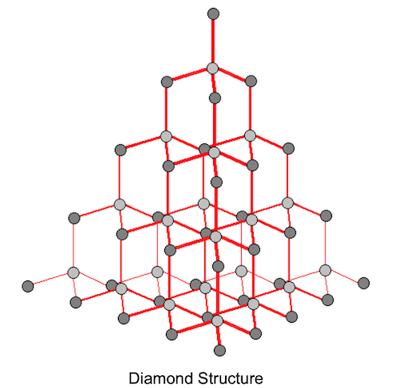
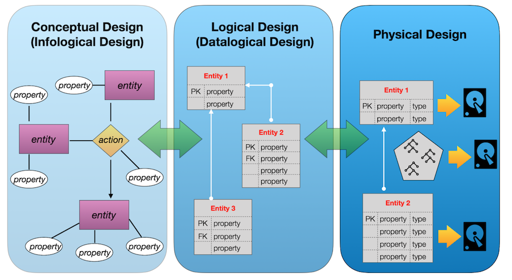

# Day 06 - Piscine SQL

## _Let's improve customer experience_

Resume: Today you will see how to add a new business feature into our data model

## Contents

1. [Chapter I](#chapter-i) \
    1.1. [Preamble](#preamble)
2. [Chapter II](#chapter-ii) \
    2.1. [General Rules](#general-rules)
3. [Chapter III](#chapter-iii) \
    3.1. [Rules of the day](#rules-of-the-day)  
4. [Chapter IV](#chapter-iv) \
    4.1. [Exercise 00 - Discounts, discounts , everyone loves discounts](#exercise-00-discounts-discounts-everyone-loves-discounts)  
5. [Chapter V](#chapter-v) \
    5.1. [Exercise 01 - Let’s set personal discounts](#exercise-01-lets-set-personal-discounts)  
6. [Chapter VI](#chapter-vi) \
    6.1. [Exercise 02 - Let’s recalculate a history of orders.](#exercise-02-lets-recalculate-a-history-of-orders)  
7. [Chapter VII](#chapter-vii) \
    7.1. [Exercise 03 - Improvements are in a way](#exercise-03-improvements-are-in-a-way)  
8. [Chapter VIII](#chapter-viii) \
    8.1. [Exercise 04 - We need more Data Consistency](#exercise-04-we-need-more-data-consistency)
9. [Chapter IX](#chapter-ix) \
    9.1. [Exercise 05 - Data Governance Rules](#exercise-05-data-governance-rules)
10. [Chapter X](#chapter-x) \
    10.1. [Exercise 06 - Let’s automate Primary Key generation](#exercise-06-lets-automate-primary-key-generation)

## Chapter I
## Preamble

Why is a diamond one of the most durable objects? The reason is in the structure. Every atom knows about his place in diamond’s topology and makes the whole diamond unbreakable. 

Logical structure is like a diamond. If you find an appropriate structure for your own Database Model then you find gold (or diamond :-). There are two aspects of Database Modeling. The first one is a logical view, in other words how your model will smoothly describe the real business world. 

On the other hand, your model should solve your functional tasks with minimal impaction. It means, logical model view transforms to physical model view and not just from table and attributes descriptions. But actually, from performance and budget perspectives that are more mainly nowadays. How to find a balance? For this case there are 3 steps to create a very good design. Just take a look at the picture below. 

## Chapter II
## General Rules

- Use this page as the only reference. Do not listen to any rumors and speculations on how to prepare your solution.
- Please make sure you are using the latest version of PostgreSQL.
- That is completely OK if you are using IDE to write a source code (aka SQL script).
- To be assessed your solution must be in your GIT repository.
- Your solutions will be evaluated by your piscine mates.
- You should not leave in your directory any other file than those explicitly specified by the exercise instructions. It is recommended that you modify your `.gitignore` to avoid accidents.
- Do you have a question? Ask your neighbor on the right. Otherwise, try with your neighbor on the left.
- Your reference manual: mates / Internet / Google. 
- Read the examples carefully. They may require things that are not otherwise specified in the subject.
- And may the SQL-Force be with you!
- Absolutely everything can be presented in SQL! Let’s start and have fun!

## Chapter III
## Rules of the day

- Please make sure you have an own database and access for it on your PostgreSQL cluster. 
- Please download a [script](materials/model.sql) with Database Model here and apply the script to your database (you can use command line with psql or just run it through any IDE, for example DataGrip from JetBrains or pgAdmin from PostgreSQL community). **Our knowledge way is incremental and linear therefore please be aware all changes that you made in Day03 during exercises 07-13 and in Day04 during exercise 07 should be on place (its similar like in real world , when we applied a release and need to be consistency with data for new changes).**
- All tasks contain a list of Allowed and Denied sections with listed database options, database types, SQL constructions etc. Please have a look at the section before you start.
- Please take a look at the Logical View of our Database Model. 

1. **pizzeria** table (Dictionary Table with available pizzerias)
- field id - primary key
- field name - name of pizzeria
- field rating - average rating of pizzeria (from 0 to 5 points)
2. **person** table (Dictionary Table with persons who loves pizza)
- field id - primary key
- field name - name of person
- field age - age of person
- field gender - gender of person
- field address - address of person
3. **menu** table (Dictionary Table with available menu and price for concrete pizza)
- field id - primary key
- field pizzeria_id - foreign key to pizzeria
- field pizza_name - name of pizza in pizzeria
- field price - price of concrete pizza
4. **person_visits** table (Operational Table with information about visits of pizzeria)
- field id - primary key
- field person_id - foreign key to person
- field pizzeria_id - foreign key to pizzeria
- field visit_date - date (for example 2022-01-01) of person visit 
5. **person_order** table (Operational Table with information about persons orders)
- field id - primary key
- field person_id - foreign key to person
- field menu_id - foreign key to menu
- field order_date - date (for example 2022-01-01) of person order 

Persons' visit and persons' order are different entities and don't contain any correlation between data. For example, a client can be in one restaurant (just looking at menu) and in this time make an order in different one by phone or by mobile application. Or another case,  just be at home and again make a call with order without any visits.

## Chapter IV
## Exercise 00 - Discounts, discounts , everyone loves discounts

| Exercise 00: Discounts, discounts , everyone loves discounts |                                                                                                                          |
|---------------------------------------|--------------------------------------------------------------------------------------------------------------------------|
| Turn-in directory                     | ex00                                                                                                                     |
| Files to turn-in                      | `day06_ex00.sql`                                                                                 |
| **Allowed**                               |                                                                                                                          |
| Language                        | SQL, DML, DDL                                                                                              |

Let’s expand our data model to involve a new business feature.
Every person wants to see a personal discount and every business wants to be closer for clients.

Please think about personal discounts for people from one side and pizzeria restaurants from other. Need to create a new relational table (please set a name `person_discounts`) with the next rules.
- set id attribute like a Primary Key (please take a look on id column in existing tables and choose the same data type)
- set for attributes person_id and pizzeria_id foreign keys for corresponding tables (data types should be the same like for id columns in corresponding parent tables)
- please set explicit names for foreign keys constraints by pattern fk_{table_name}_{column_name},  for example `fk_person_discounts_person_id`
- add a discount attribute to store a value of discount in percent. Remember, discount value can be a number with floats (please just use `numeric` data type). So, please choose the corresponding data type to cover this possibility.

## Chapter V
## Exercise 01 - Let’s set personal discounts

| Exercise 01: Let’s set personal discounts|                                                                                                                          |
|---------------------------------------|--------------------------------------------------------------------------------------------------------------------------|
| Turn-in directory                     | ex01                                                                                                                     |
| Files to turn-in                      | `day06_ex01.sql`                                                                                 |
| **Allowed**                               |                                                                                                                          |
| Language                        | SQL, DML, DDL                                                                                              |

Actually, we created a structure to store our discounts and we are ready to go further and fill our `person_discounts` table with new records.

So, there is a table `person_order` that stores the history of a person's orders. Please write a DML statement (`INSERT INTO ... SELECT ...`) that makes  inserts new records into `person_discounts` table based on the next rules.
- take aggregated state by person_id and pizzeria_id columns 
- calculate personal discount value by the next pseudo code:

    `if “amount of orders” = 1 then
        “discount” = 10.5 
    else if “amount of orders” = 2 then 
        “discount” = 22
    else 
        “discount” = 30`

- to generate a primary key for the person_discounts table please use  SQL construction below (this construction is from the WINDOW FUNCTION  SQL area).
    
    `... ROW_NUMBER( ) OVER ( ) AS id ...`

## Chapter VI
## Exercise 02 - Let’s recalculate a history of orders

| Exercise 02: Let’s recalculate a history of orders|                                                                                                                          |
|---------------------------------------|--------------------------------------------------------------------------------------------------------------------------|
| Turn-in directory                     | ex02                                                                                                                     |
| Files to turn-in                      | `day06_ex02.sql`                                                                                 |
| **Allowed**                               |                                                                                                                          |
| Language                        | SQL, DML, DDL                                                                                              |

Please write a SQL statement that returns orders with actual price and price with applied discount for each person in the corresponding pizzeria restaurant and sort by person name, and pizza name. Please take a look at the sample of data below.

| name | pizza_name | price | discount_price | pizzeria_name | 
| ------ | ------ | ------ | ------ | ------ |
| Andrey | cheese pizza | 800 | 624 | Dominos |
| Andrey | mushroom pizza | 1100 | 858 | Dominos |
| ... | ... | ... | ... | ... |

## Chapter VII
## Exercise 03 - Improvements are in a way

| Exercise 03: Improvements are in a way |                                                                                                                          |
|---------------------------------------|--------------------------------------------------------------------------------------------------------------------------|
| Turn-in directory                     | ex03                                                                                                                     |
| Files to turn-in                      | `day06_ex03.sql`                                                                                 |
| **Allowed**                               |                                                                                                                          |
| Language                        | SQL, DML, DDL                                                                                              |

Actually, we have to make improvements to data consistency from one side and performance tuning from the other side. Please create a multicolumn unique index (with name `idx_person_discounts_unique`) that prevents duplicates of pair values person and pizzeria identifiers.

After creation of a new index, please provide any simple SQL statement that shows proof of index usage (by using `EXPLAIN ANALYZE`).
The example of “proof” is below
    
    ...
    Index Scan using idx_person_discounts_unique on person_discounts
    ...

## Chapter VIII
## Exercise 04 - We need more Data Consistency

| Exercise 04: We need more Data Consistency |                                                                                                                          |
|---------------------------------------|--------------------------------------------------------------------------------------------------------------------------|
| Turn-in directory                     | ex04                                                                                                                     |
| Files to turn-in                      | `day06_ex04.sql`                                                                                 |
| **Allowed**                               |                                                                                                                          |
| Language                        | SQL, DML, DDL                                                                                              |

Please add the following constraint rules for existing columns of the `person_discounts` table.
- person_id column should not be NULL (use constraint name `ch_nn_person_id`)
- pizzeria_id column should not be NULL (use constraint name `ch_nn_pizzeria_id`)
- discount column should not be NULL (use constraint name `ch_nn_discount`)
- discount column should be 0 percent by default
- discount column should be in a range values from 0 to 100 (use constraint name `ch_range_discount`)

## Chapter IX
## Exercise 05 - Data Governance Rules

| Exercise 05: Data Governance Rules|                                                                                                                          |
|---------------------------------------|--------------------------------------------------------------------------------------------------------------------------|
| Turn-in directory                     | ex05                                                                                                                     |
| Files to turn-in                      | `day06_ex05.sql`                                                                                 |
| **Allowed**                               |                                                                                                                          |
| Language                        |  SQL, DML, DDL                                                                                              |

To satisfy Data Governance Policies need to add comments for the table and table's columns. Let’s apply this policy for the `person_discounts` table. Please add English or Russian comments (it's up to you) that explain what is a business goal of a table and all included attributes. 

## Chapter X
## Exercise 06 - Let’s automate Primary Key generation

| Exercise 06: Let’s automate Primary Key generation|                                                                                                                          |
|---------------------------------------|--------------------------------------------------------------------------------------------------------------------------|
| Turn-in directory                     | ex06                                                                                                                     |
| Files to turn-in                      | `day06_ex06.sql`                                                                                 |
| **Allowed**                               |                                                                                                                          |
| Language                        | SQL, DML, DDL                                                                                              |
| **Denied**                               |                                                                                                                          |
| SQL Syntax Pattern                        | Don’t use hard-coded value for amount of rows to set a right value for sequence                                                                                              |

Let’s create a Database Sequence with the name `seq_person_discounts` (starting from 1 value) and set a default value for id attribute of `person_discounts` table to take a value from `seq_person_discounts` each time automatically. 
Please be aware that your next sequence number is 1, in this case please set an actual value for database sequence based on formula “amount of rows in person_discounts table” + 1. Otherwise you will get errors about Primary Key violation constraint.

