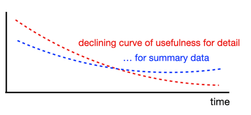

# Day 07 - Piscine SQL

## _Aggregated data is more informative, isn't it?_

Resume: Today you will see how to use specific OLAP constructions to get a “Value” from data

## Contents

1. [Chapter I](#chapter-i) \
    1.1. [Preamble](#preamble)
2. [Chapter II](#chapter-ii) \
    2.1. [General Rules](#general-rules)
3. [Chapter III](#chapter-iii) \
    3.1. [Rules of the day](#rules-of-the-day)  
4. [Chapter IV](#chapter-iv) \
    4.1. [Exercise 00 - Simple aggregated information](#exercise-00-simple-aggregated-information)  
5. [Chapter V](#chapter-v) \
    5.1. [Exercise 01 - Let’s see real names](#exercise-01-lets-see-real-names)  
6. [Chapter VI](#chapter-vi) \
    6.1. [Exercise 02 - Restaurants statistics](#exercise-02-restaurants-statistics)  
7. [Chapter VII](#chapter-vii) \
    7.1. [Exercise 03 - Restaurants statistics #2](#exercise-03-restaurants-statistics-2)  
8. [Chapter VIII](#chapter-viii) \
    8.1. [Exercise 04 - Clause for groups](#exercise-04-clause-for-groups)
9. [Chapter IX](#chapter-ix) \
    9.1. [Exercise 05 - Person's uniqueness](#exercise-05-persons-uniqueness)
10. [Chapter X](#chapter-x) \
    10.1. [Exercise 06 - Restaurant metrics](#exercise-06-restaurant-metrics)
11. [Chapter XI](#chapter-xi) \
    11.1. [Exercise 07 - Average global rating](#exercise-07-average-global-rating)
12. [Chapter XII](#chapter-xii) \
    12.1. [Exercise 08 - Find pizzeria’s restaurant locations](#exercise-08-find-pizzerias-restaurant-locations)    
13. [Chapter XIII](#chapter-xiii) \
    13.1. [Exercise 09 - Explicit type transformation](#exercise-09-explicit-type-transformation)        

## Chapter I
## Preamble

Please take a look at Curve of Usefulness for detailed data in time. Other words, detailed data (means user transactions, facts about products and providers, etc.) are not useful for us from a historical perspective, because we just need to know  some aggregation to describe what was going on a year ago.

Why does it happen? The reason is in our analytical mind. Actually we want to concentrate on our business strategy from a historical perspective to set new business goals and we don’t need details. 

From a database point of view, “Analytical mind” corresponds to OLAP  traffic (information layer), “details” corresponds to OLTP traffic (raw data layer). Today there is a more flexible pattern to store detailed data and aggregated information in the ecosystem. I am talking about `LakeHouse = DataLake + DataWareHouse`.

If we are talking about historical data then we should mention the “Data lifecycle management” pattern. Simple words, what should we do with old data? TTL (time-to-live), SLA for data, Retention Data Policy, etc. are terms that are in use in Data Governance strategy.

## Chapter II
## General Rules

- Use this page as the only reference. Do not listen to any rumors and speculations on how to prepare your solution.
- Please make sure you are using the latest version of PostgreSQL.
- That is completely OK if you are using IDE to write a source code (aka SQL script).
- To be assessed your solution must be in your GIT repository.
- Your solutions will be evaluated by your piscine mates.
- You should not leave in your directory any other file than those explicitly specified by the exercise instructions. It is recommended that you modify your `.gitignore` to avoid accidents.
- Do you have a question? Ask your neighbor on the right. Otherwise, try with your neighbor on the left.
- Your reference manual: mates / Internet / Google. 
- Read the examples carefully. They may require things that are not otherwise specified in the subject.
- And may the SQL-Force be with you!
- Absolutely everything can be presented in SQL! Let’s start and have fun!

## Chapter III
## Rules of the day

- Please make sure you have an own database and access for it on your PostgreSQL cluster. 
- Please download a [script](materials/model.sql) with Database Model here and apply the script to your database (you can use command line with psql or just run it through any IDE, for example DataGrip from JetBrains or pgAdmin from PostgreSQL community). **Our knowledge way is incremental and linear therefore please be aware all changes that you made in Day03 during exercises 07-13 and in Day04 during exercise 07 should be on place (its similar like in real world , when we applied a release and need to be consistency with data for new changes).**
- All tasks contain a list of Allowed and Denied sections with listed database options, database types, SQL constructions etc. Please have a look at the section before you start.
- Please take a look at the Logical View of our Database Model. 

1. **pizzeria** table (Dictionary Table with available pizzerias)
- field id - primary key
- field name - name of pizzeria
- field rating - average rating of pizzeria (from 0 to 5 points)
2. **person** table (Dictionary Table with persons who loves pizza)
- field id - primary key
- field name - name of person
- field age - age of person
- field gender - gender of person
- field address - address of person
3. **menu** table (Dictionary Table with available menu and price for concrete pizza)
- field id - primary key
- field pizzeria_id - foreign key to pizzeria
- field pizza_name - name of pizza in pizzeria
- field price - price of concrete pizza
4. **person_visits** table (Operational Table with information about visits of pizzeria)
- field id - primary key
- field person_id - foreign key to person
- field pizzeria_id - foreign key to pizzeria
- field visit_date - date (for example 2022-01-01) of person visit 
5. **person_order** table (Operational Table with information about persons orders)
- field id - primary key
- field person_id - foreign key to person
- field menu_id - foreign key to menu
- field order_date - date (for example 2022-01-01) of person order 

Persons' visit and persons' order are different entities and don't contain any correlation between data. For example, a client can be in one restaurant (just looking at menu) and in this time make an order in different one by phone or by mobile application. Or another case,  just be at home and again make a call with order without any visits.

## Chapter IV
## Exercise 00 - Simple aggregated information

| Exercise 00: Simple aggregated information |                                                                                                                          |
|---------------------------------------|--------------------------------------------------------------------------------------------------------------------------|
| Turn-in directory                     | ex00                                                                                                                     |
| Files to turn-in                      | `day07_ex00.sql`                                                                                 |
| **Allowed**                               |                                                                                                                          |
| Language                        | ANSI SQL|

Let’s make a simple aggregation, please write a SQL statement that returns person identifiers and corresponding number of visits in any pizzerias and sorting by count of visits in descending mode and sorting in `person_id` in ascending mode. Please take a look at the sample of data below.

| person_id | count_of_visits |
| ------ | ------ |
| 9 | 4 |
| 4 | 3 |
| ... | ... | 

## Chapter V
## Exercise 01 - Let’s see real names

| Exercise 01: Let’s see real names|                                                                                                                          |
|---------------------------------------|--------------------------------------------------------------------------------------------------------------------------|
| Turn-in directory                     | ex01                                                                                                                     |
| Files to turn-in                      | `day07_ex01.sql`                                                                                 |
| **Allowed**                               |                                                                                                                          |
| Language                        | ANSI SQL                                                                                              |

Please change a SQL statement from Exercise 00 and return a person name (not identifier). Additional clause is  we need to see only top-4 persons with maximal visits in any pizzerias and sorted by a person name. Please take a look at the example of output data below.

| name | count_of_visits |
| ------ | ------ |
| Dmitriy | 4 |
| Denis | 3 |
| ... | ... | 

## Chapter VI
## Exercise 02 - Restaurants statistics

| Exercise 02: Restaurants statistics|                                                                                                                          |
|---------------------------------------|--------------------------------------------------------------------------------------------------------------------------|
| Turn-in directory                     | ex02                                                                                                                     |
| Files to turn-in                      | `day07_ex02.sql`                                                                                 |
| **Allowed**                               |                                                                                                                          |
| Language                        | ANSI SQL                                                                                              |

Please write a SQL statement to see 3 favorite restaurants by visits and by orders in one list (please add an action_type column with values ‘order’ or ‘visit’, it depends on data from the corresponding table). Please take a look at the sample of data below. The result should be sorted by action_type column in ascending mode and by count column in descending mode.

| name | count | action_type |
| ------ | ------ | ------ |
| Dominos | 6 | order |
| ... | ... | ... |
| Dominos | 7 | visit |
| ... | ... | ... |

## Chapter VII
## Exercise 03 - Restaurants statistics #2

| Exercise 03: Restaurants statistics #2 |                                                                                                                          |
|---------------------------------------|--------------------------------------------------------------------------------------------------------------------------|
| Turn-in directory                     | ex03                                                                                                                     |
| Files to turn-in                      | `day07_ex03.sql`                                                                                 |
| **Allowed**                               |                                                                                                                          |
| Language                        | ANSI SQL                                                                                              |

Please write a SQL statement to see restaurants are grouping by visits and by orders and joined with each other by using restaurant name.  
You can use internal SQLs from Exercise 02 (restaurants by visits and by orders) without limitations of amount of rows.

Additionally, please add the next rules.
- calculate a sum of orders and visits for corresponding pizzeria (be aware, not all pizzeria keys are presented in both tables).
- sort results by `total_count` column in descending mode and by `name` in ascending mode.
Take a look at the data sample below.

| name | total_count |
| ------ | ------ |
| Dominos | 13 |
| DinoPizza | 9 |
| ... | ... | 

## Chapter VIII
## Exercise 04 - Clause for groups

| Exercise 04: Clause for groups |                                                                                                                          |
|---------------------------------------|--------------------------------------------------------------------------------------------------------------------------|
| Turn-in directory                     | ex04                                                                                                                     |
| Files to turn-in                      | `day07_ex04.sql`                                                                                 |
| **Allowed**                               |                                                                                                                          |
| Language                        | ANSI SQL                                                                                              |
| **Denied**                               |                                                                                                                          |
| Syntax construction                        | `WHERE`                                                                                              |

Please write a SQL statement that returns the person name and corresponding number of visits in any pizzerias if the person has visited more than 3 times (> 3).Please take a look at the sample of data below.

| name | count_of_visits |
| ------ | ------ |
| Dmitriy | 4 |

## Chapter IX
## Exercise 05 - Person's uniqueness

| Exercise 05: Person's uniqueness|                                                                                                                          |
|---------------------------------------|--------------------------------------------------------------------------------------------------------------------------|
| Turn-in directory                     | ex05                                                                                                                     |
| Files to turn-in                      | `day07_ex05.sql`                                                                                 |
| **Allowed**                               |                                                                                                                          |
| Language                        |  ANSI SQL                                                                                              |
| **Denied**                               |                                                                                                                          |
| Syntax construction                        |  `GROUP BY`, any type (`UNION`,...) working with sets                                                                                              |

Please write a simple SQL query that returns a list of unique person names who made orders in any pizzerias. The result should be sorted by person name. Please take a look at the sample below.

| name | 
| ------ |
| Andrey |
| Anna | 
| ... | 

## Chapter X
## Exercise 06 - Restaurant metrics

| Exercise 06: Restaurant metrics|                                                                                                                          |
|---------------------------------------|--------------------------------------------------------------------------------------------------------------------------|
| Turn-in directory                     | ex06                                                                                                                     |
| Files to turn-in                      | `day07_ex06.sql`                                                                                 |
| **Allowed**                               |                                                                                                                          |
| Language                        | ANSI SQL                                                                                              |

Please write a SQL statement that returns the amount of orders, average of price, maximum and minimum prices for sold pizza by corresponding pizzeria restaurant. The result should be sorted by pizzeria name. Please take a look at the data sample below. 
Round your average price to 2 floating numbers.

| name | count_of_orders | average_price | max_price | min_price |
| ------ | ------ | ------ | ------ | ------ |
| Best Pizza | 5 | 780 | 850 | 700 |
| DinoPizza | 5 | 880 | 1000 | 800 |
| ... | ... | ... | ... | ... |

## Chapter XI
## Exercise 07 - Average global rating

| Exercise 07: Average global rating|                                                                                                                          |
|---------------------------------------|--------------------------------------------------------------------------------------------------------------------------|
| Turn-in directory                     | ex07                                                                                                                     |
| Files to turn-in                      | `day07_ex07.sql`                                                                                 |
| **Allowed**                               |                                                                                                                          |
| Language                        | ANSI SQL                                                                                              |

Please write a SQL statement that returns a common average rating (the output attribute name is global_rating) for all restaurants. Round your average rating to 4 floating numbers.

## Chapter XII
## Exercise 08 - Find pizzeria’s restaurant locations

| Exercise 08: Find pizzeria’s restaurant locations|                                                                                                                          |
|---------------------------------------|--------------------------------------------------------------------------------------------------------------------------|
| Turn-in directory                     | ex08                                                                                                                     |
| Files to turn-in                      | `day07_ex08.sql`                                                                                 |
| **Allowed**                               |                                                                                                                          |
| Language                        | ANSI SQL                                                                                              |

We know about personal addresses from our data. Let’s imagine, that particular person visits pizzerias in his/her city only. Please write a SQL statement that returns address, pizzeria name and amount of persons’ orders. The result should be sorted by address and then by restaurant name. Please take a look at the sample of output data below.

| address | name |count_of_orders |
| ------ | ------ |------ |
| Kazan | Best Pizza |4 |
| Kazan | DinoPizza |4 |
| ... | ... | ... | 

## Chapter XIII
## Exercise 09 - Explicit type transformation

| Exercise 09: Explicit type transformation|                                                                                                                          |
|---------------------------------------|--------------------------------------------------------------------------------------------------------------------------|
| Turn-in directory                     | ex09                                                                                                                     |
| Files to turn-in                      | `day07_ex09.sql`                                                                                 |
| **Allowed**                               |                                                                                                                          |
| Language                        | ANSI SQL                                                                                              |

Please write a SQL statement that returns aggregated information by person’s address , the result of “Maximal Age - (Minimal Age  / Maximal Age)” that is presented as a formula column, next one is average age per address and the result of comparison between formula and average columns (other words, if formula is greater than  average then True, otherwise False value).

The result should be sorted by address column. Please take a look at the sample of output data below.

| address | formula |average | comparison |
| ------ | ------ |------ |------ |
| Kazan | 44.71 |30.33 | true |
| Moscow | 20.24 | 18.5 | true |
| ... | ... | ... | ... |

