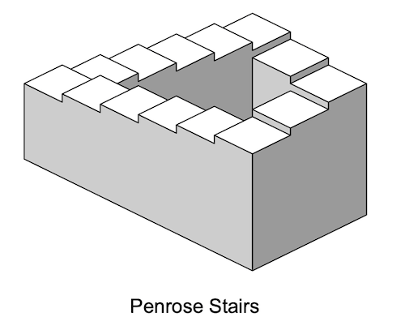
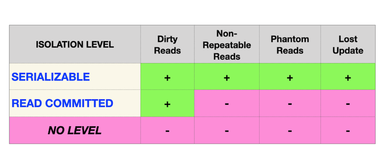

# Day 08 - Piscine SQL

## _Isolation is one of ACID properties_

Resume: Today you will see how database works with transactions and isolation levels

## Contents

1. [Chapter I](#chapter-i) \
    1.1. [Preamble](#preamble)
2. [Chapter II](#chapter-ii) \
    2.1. [General Rules](#general-rules)
3. [Chapter III](#chapter-iii) \
    3.1. [Rules of the day](#rules-of-the-day)  
4. [Chapter IV](#chapter-iv) \
    4.1. [Exercise 00 - Simple transaction](#exercise-00-simple-transaction)  
5. [Chapter V](#chapter-v) \
    5.1. [Exercise 01 - Lost Update Anomaly](#exercise-01-lost-update-anomaly)  
6. [Chapter VI](#chapter-vi) \
    6.1. [Exercise 02 - Lost Update for Repeatable Read](#exercise-02-lost-update-for-repeatable-read)  
7. [Chapter VII](#chapter-vii) \
    7.1. [Exercise 03 - Non-Repeatable Reads Anomaly](#exercise-03-non-repeatable-reads-anomaly)  
8. [Chapter VIII](#chapter-viii) \
    8.1. [Exercise 04 - Non-Repeatable Reads for Serialization](#exercise-04-non-repeatable-reads-for-serialization)
9. [Chapter IX](#chapter-ix) \
    9.1. [Exercise 05 - Phantom Reads Anomaly](#exercise-05-phantom-reads-anomaly)
10. [Chapter X](#chapter-x) \
    10.1. [Exercise 06 - Phantom Reads for Repeatable Read](#exercise-06-phantom-reads-for-repeatable-read)
11. [Chapter XI](#chapter-xi) \
    11.1. [Exercise 07 - Deadlock](#exercise-07-deadlock)
      

## Chapter I
## Preamble

The Penrose stairs or Penrose steps, also dubbed the impossible staircase, is an impossible object created by Lionel Penrose and his son Roger Penrose. A variation on the Penrose triangle, it is a two-dimensional depiction of a staircase in which the stairs make four 90-degree turns as they ascend or descend yet form a continuous loop, so that a person could climb them forever and never get any higher. This is clearly impossible in three dimensions. The "continuous staircase" was first presented in an article that the Penroses wrote in 1959, based on the so-called "triangle of Penrose" published by Roger Penrose in the British Journal of Psychology in 1958. 

“Penrose Stairs” is a mathematical anomaly, actually Database Theory has 4 foundametal data anomalies (physical anomalies).
- Lost Update Anomaly
- Dirty Reads Anomaly
- Non-repeatable Reads Anomaly
- Phantom Read Anomaly

Therefore there are different Isolation Levels in ANSI SQL standard that prevent famous anomalies.

From one side this matrix should be a Standard for every Relational Database, but reality ... looks a bit different.

|  |  | |
| ------ | ------ | ------ |
| PostgreSQL |  |
| Oracle |  |
| MySQL |  |

Nowadays, IT community found a set of new anomalies based on Database Model (logical view)
- Read Skew Anomaly
- Write Skew Anomaly
- Serialization Anomaly
- Fan Traps Anomaly
- Chasm Traps Anomaly 
- Data Model Loops Anomaly
- etc.

## Chapter II
## General Rules

- Use this page as the only reference. Do not listen to any rumors and speculations on how to prepare your solution.
- Please make sure you are using the latest version of PostgreSQL.
- That is completely OK if you are using IDE to write a source code (aka SQL script).
- To be assessed your solution must be in your GIT repository.
- Your solutions will be evaluated by your piscine mates.
- You should not leave in your directory any other file than those explicitly specified by the exercise instructions. It is recommended that you modify your `.gitignore` to avoid accidents.
- Do you have a question? Ask your neighbor on the right. Otherwise, try with your neighbor on the left.
- Your reference manual: mates / Internet / Google. 
- Read the examples carefully. They may require things that are not otherwise specified in the subject.
- And may the SQL-Force be with you!
- Absolutely everything can be presented in SQL! Let’s start and have fun!

## Chapter III
## Rules of the day

- Please make sure you have an own database and access for it on your PostgreSQL cluster. 
- Please download a [script](materials/model.sql) with Database Model here and apply the script to your database (you can use command line with psql or just run it through any IDE, for example DataGrip from JetBrains or pgAdmin from PostgreSQL community). **Our knowledge way is incremental and linear therefore please be aware all changes that you made in Day03 during exercises 07-13 and in Day04 during exercise 07 should be on place (its similar like in real world , when we applied a release and need to be consistency with data for new changes).**
- All tasks contain a list of Allowed and Denied sections with listed database options, database types, SQL constructions etc. Please have a look at the section before you start.
- Please take a look at the Logical View of our Database Model. 

1. **pizzeria** table (Dictionary Table with available pizzerias)
- field id - primary key
- field name - name of pizzeria
- field rating - average rating of pizzeria (from 0 to 5 points)
2. **person** table (Dictionary Table with persons who loves pizza)
- field id - primary key
- field name - name of person
- field age - age of person
- field gender - gender of person
- field address - address of person
3. **menu** table (Dictionary Table with available menu and price for concrete pizza)
- field id - primary key
- field pizzeria_id - foreign key to pizzeria
- field pizza_name - name of pizza in pizzeria
- field price - price of concrete pizza
4. **person_visits** table (Operational Table with information about visits of pizzeria)
- field id - primary key
- field person_id - foreign key to person
- field pizzeria_id - foreign key to pizzeria
- field visit_date - date (for example 2022-01-01) of person visit 
5. **person_order** table (Operational Table with information about persons orders)
- field id - primary key
- field person_id - foreign key to person
- field menu_id - foreign key to menu
- field order_date - date (for example 2022-01-01) of person order 

Persons' visit and persons' order are different entities and don't contain any correlation between data. For example, a client can be in one restraunt (just looking at menu) and in this time make an order in different one by phone or by mobile application. Or another case,  just be at home and again make a call with order without any visits.

## Chapter IV
## Exercise 00 - Simple transaction

| Exercise 00: Simple transaction |                                                                                                                          |
|---------------------------------------|--------------------------------------------------------------------------------------------------------------------------|
| Turn-in directory                     | ex00                                                                                                                     |
| Files to turn-in                      | `day08_ex00.sql` with comments for Session #1, Session #2 statements; screenshot of psql output for Session #1; screenshot of psql output for Session #2 |
| **Allowed**                               |                                                                                                                          |
| Language                        |  SQL|

Please for this task use the command line for PostgreSQL database (psql). You need to check how your changes will be published in the database for other database users. 

Actually, we need two active sessions (meaning 2 parallel sessions in the command lines). 

Please provide a proof that your parallel session can’t see your changes until you will make a `COMMIT`;

Take a look at the steps below.

**Session #1**
- update of rating for “Pizza Hut” to 5 points in a transaction mode .
- check that you can see a changes in session #1

**Session #2**
- check that you can’t see a changes in session #2

**Session #1**
- publish your changes for all parallel sessions.

**Session #2**
- check that you can see a changes in session #2

So, take a look on example of my output for Session #2.

    pizza_db=> select * from pizzeria where name  = 'Pizza Hut';
    id |   name    | rating
    ----+-----------+--------
    1 | Pizza Hut |    4.6
    (1 row)

    pizza_db=> select * from pizzeria where name  = 'Pizza Hut';
    id |   name    | rating
    ----+-----------+--------
    1 | Pizza Hut |      5
    (1 row)

You can see the same query returns different results, because the first one was run before publishing in Session#1 and the second one was queried after finished Session#1. 

## Chapter V
## Exercise 01 - Lost Update Anomaly

| Exercise 01: Lost Update Anomaly|                                                                                                                          |
|---------------------------------------|--------------------------------------------------------------------------------------------------------------------------|
| Turn-in directory                     | ex01                                                                                                                     |
| Files to turn-in                      | `day08_ex01.sql` with comments for Session #1, Session #2 statements; screenshot of psql output for Session #1; screenshot of psql output for Session #2                                                                                 |
| **Allowed**                               |                                                                                                                          |
| Language                        |  SQL                                                                                              |

Please for this task use the command line for PostgreSQL database (psql). You need to check how your changes will be published in the database for other database users. 

Actually, we need two active sessions (meaning 2 parallel sessions in the command lines). 

Before a task, make sure you are at a default isolation level in your database. Just run the next statement

`SHOW TRANSACTION ISOLATION LEVEL;`

and the result should be “read committed”;

If not, then please set “read committed” isolation level explicitly on a session level.

|  |  |
| ------ | ------ |
| Let’s check one of the famous “Lost Update Anomaly” database pattern. You can see a graphical presentation of that anomaly on a picture. Horizontal Red Line means the final results after all sequential steps for both Sessions. |  |

Please check a rating for “Pizza Hut” in a transaction mode for both Sessions and after that make `UPDATE` of rating to 4 value in session #1 and make `UPDATE` of rating to 3.6 value in session #2 (in the same order as in the picture). 

## Chapter VI
## Exercise 02 - Lost Update for Repeatable Read

| Exercise 02: Lost Update for Repeatable Read|                                                                                                                          |
|---------------------------------------|--------------------------------------------------------------------------------------------------------------------------|
| Turn-in directory                     | ex02                                                                                                                     |
| Files to turn-in                      | `day08_ex02.sql` with comments for Session #1, Session #2 statements; screenshot of psql output for Session #1; screenshot of psql output for Session #2                                                                                  |
| **Allowed**                               |                                                                                                                          |
| Language                        |  SQL                                                                                              |

Please for this task use the command line for PostgreSQL database (psql). You need to check how your changes will be published in the database for other database users. 

Actually, we need two active sessions (meaning 2 parallel sessions in the command lines).

|  |  |
| ------ | ------ |
| Let’s check one of the famous “Lost Update Anomaly” database pattern but under `REPEATABLE READ` isolation level. You can see a graphical presentation of that anomaly on a picture. Horizontal Red Line means the final results after all sequential steps for both Sessions. |  |

Please check a rating for “Pizza Hut” in a transaction mode for both Sessions and after that make `UPDATE` of rating to 4 value in session #1 and make `UPDATE` of rating to 3.6 value in session #2 (in the same order as in the picture). 

## Chapter VII
## Exercise 03 - Non-Repeatable Reads Anomaly

| Exercise 03: Non-Repeatable Reads Anomaly |                                                                                                                          |
|---------------------------------------|--------------------------------------------------------------------------------------------------------------------------|
| Turn-in directory                     | ex03                                                                                                                     |
| Files to turn-in                      | `day08_ex03.sql` with comments for Session #1, Session #2 statements; screenshot of psql output for Session #1; screenshot of psql output for Session #2                                                                                 |
| **Allowed**                               |                                                                                                                          |
| Language                        |  SQL                                                                                              |

Please for this task use the command line for PostgreSQL database (psql). You need to check how your changes will be published in the database for other database users. 

Actually, we need two active sessions (meaning 2 parallel sessions in the command lines). 

|  |  |
| ------ | ------ |
| Let’s check one of the famous “Non-Repeatable Reads” database pattern but under `READ COMMITTED` isolation level. You can see a graphical presentation of that anomaly on a picture. Horizontal Red Line means the final results after all sequential steps for both Sessions. |  |

Please check a rating for “Pizza Hut” in a transaction mode for both Sessions and after that make `UPDATE` of rating to 3.6 value in session #2 (in the same order as in the picture). 

## Chapter VIII
## Exercise 04 - Non-Repeatable Reads for Serialization

| Exercise 04: Non-Repeatable Reads for Serialization |                                                                                                                          |
|---------------------------------------|--------------------------------------------------------------------------------------------------------------------------|
| Turn-in directory                     | ex04                                                                                                                     |
| Files to turn-in                      | `day08_ex04.sql` with comments for Session #1, Session #2 statements; screenshot of psql output for Session #1; screenshot of psql output for Session #2                                                                                 |
| **Allowed**                               |                                                                                                                          |
| Language                        |  SQL                                                                                              |

Please for this task use the command line for PostgreSQL database (psql). You need to check how your changes will be published in the database for other database users. 

Actually, we need two active sessions (meaning 2 parallel sessions in the command lines).

|  |  |
| ------ | ------ |
| Let’s check one of the famous “Non-Repeatable Reads” database pattern but under `SERIALIZABLE` isolation level. You can see a graphical presentation of that anomaly on a picture. Horizontal Red Line means the final results after all sequential steps for both Sessions. |  |

Please check a rating for “Pizza Hut” in a transaction mode for both Sessions and after that make `UPDATE` of rating to 3.0 value in session #2 (in the same order as in the picture). 

## Chapter IX
## Exercise 05 - Phantom Reads Anomaly

| Exercise 05: Phantom Reads Anomaly|                                                                                                                          |
|---------------------------------------|--------------------------------------------------------------------------------------------------------------------------|
| Turn-in directory                     | ex05                                                                                                                     |
| Files to turn-in                      | `day08_ex05.sql`  with comments for Session #1, Session #2 statements; screenshot of psql output for Session #1; screenshot of psql output for Session #2                                                                                 |
| **Allowed**                               |                                                                                                                          |
| Language                        |   SQL                                                                                              |

Please for this task use the command line for PostgreSQL database (psql). You need to check how your changes will be published in the database for other database users. 

Actually, we need two active sessions (meaning 2 parallel sessions in the command lines).

|  |  |
| ------ | ------ |
| Let’s check one of the famous “Phantom Reads” database pattern but under `READ COMMITTED` isolation level. You can see a graphical presentation of that anomaly on a picture. Horizontal Red Line means the final results after all sequential steps for both Sessions. |  |

Please summarize all ratings for all pizzerias in a transaction mode for both Sessions and after that make `UPDATE` of rating to 1 value for “Pizza Hut” restaurant in session #2 (in the same order as in the picture). 

 

## Chapter X
## Exercise 06 - Phantom Reads for Repeatable Read

| Exercise 06: Phantom Reads for Repeatable Read|                                                                                                                          |
|---------------------------------------|--------------------------------------------------------------------------------------------------------------------------|
| Turn-in directory                     | ex06                                                                                                                     |
| Files to turn-in                      | `day08_ex06.sql`  with comments for Session #1, Session #2 statements; screenshot of psql output for Session #1; screenshot of psql output for Session #2                                                                                 |
| **Allowed**                               |                                                                                                                          |
| Language                        |  SQL                                                                                              |

Please for this task use the command line for PostgreSQL database (psql). You need to check how your changes will be published in the database for other database users. 

Actually, we need two active sessions (meaning 2 parallel sessions in the command lines).

|  |  |
| ------ | ------ |
| Let’s check one of the famous “Phantom Reads” database pattern but under `REPEATABLE READ` isolation level. You can see a graphical presentation of that anomaly on a picture. Horizontal Red Line means the final results after all sequential steps for both Sessions. |  |

Please summarize all ratings for all pizzerias in a transaction mode for both Sessions and after that make `UPDATE` of rating to 5 value for “Pizza Hut” restaurant in session #2 (in the same order as in the picture). 

## Chapter XI
## Exercise 07 - Deadlock

| Exercise 07: Deadlock|                                                                                                                          |
|---------------------------------------|--------------------------------------------------------------------------------------------------------------------------|
| Turn-in directory                     | ex07                                                                                                                     |
| Files to turn-in                      | `day08_ex07.sql`    with comments for Session #1, Session #2 statements; screenshot of psql output for Session #1; screenshot of psql output for Session #2                                                                                |
| **Allowed**                               |                                                                                                                          |
| Language                        |  SQL                                                                                              |

Please for this task use the command line for PostgreSQL database (psql). You need to check how your changes will be published in the database for other database users. 

Actually, we need two active sessions (meaning 2 parallel sessions in the command lines). 

Let’s reproduce a deadlock situation in our database. 

|  |  |
| ------ | ------ |
| You can see a graphical presentation of the deadlock situation on a picture. Looks like a “christ-lock” between parallel sessions. |  |

Please write any SQL statement with any isolation level (you can use default setting) on the `pizzeria` table to reproduce this deadlock situation.

